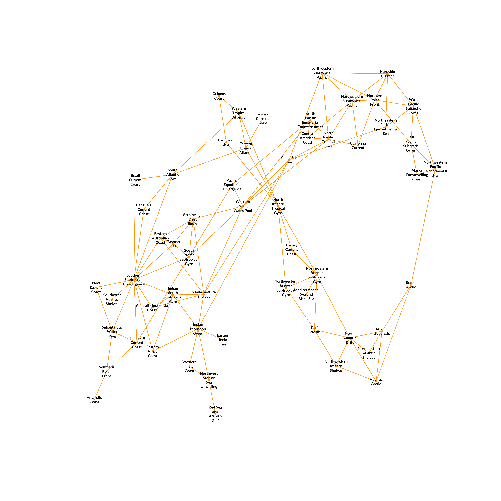
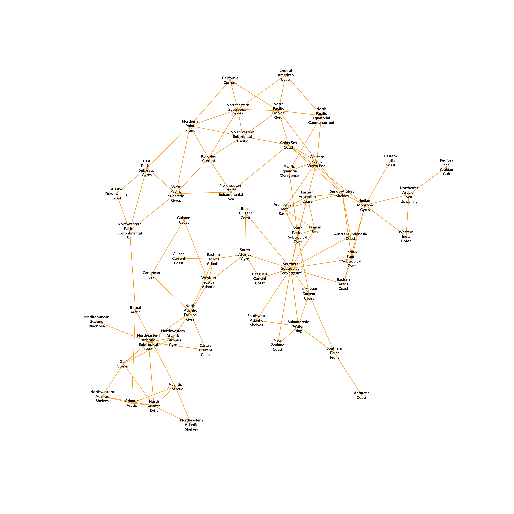

A Network of Oceanic Regions
============================

``` r
suppressMessages(library(igraph))
suppressMessages(library(tidyverse))
suppressMessages(library(knitr))
suppressMessages(library(rmarkdown))
```

``` r
nodes <- read.csv("OceanicRegion_Nodes.csv", header = T, as.is = T)
```

``` r
positive <- read.csv("OceanicRegion_Links.csv", header = T, as.is = T)
positive_plot <- graph_from_data_frame(d = positive, vertices = nodes, directed = T)
```

Plotting trophic interactions in five steps
-------------------------------------------

Step 2 removes links that weight less than the average of all weights for that plot. Redundancies and loops are removed as well.

Step 3 defines the node labels, using the functional group names. Font, font size, and vertex dot size is specified.

Step 4 defines the links between nodes. Here the weights are squared and the result is amplified by a factor of 5, so that the relative width of links can be visually comparable.

Step 5 plots the network. The layout of the plot is specified.

### For positive net impact

``` r
# Step 1
wrap_strings <- function(vector_of_strings, width) {
  as.character(sapply(vector_of_strings,
    FUN = function(x) {
      paste(strwrap(x, width = width),
        collapse = "\n"
      )
    }
  ))
}
# Step 2
positive_net <- igraph::simplify(positive_plot, remove.multiple = TRUE, remove.loops = TRUE, edge.attr.comb = igraph_opt("edge.attr.comb"))
# Step 3
V(positive_net)$vertex.size <- .01
V(positive_net)$label.cex <- .3
V(positive_net)$label.family <- "Lato Bold"
V(positive_net)$label.color <- "black"
V(positive_net)$size <- .0001
V(positive_net)$label <- wrap_strings(V(positive_net)$Nickname, 10)
# Step 4
E(positive_net)$width <- .7
E(positive_net)$color <- "orange"
E(positive_net)$arrow.size <- .00005
```

``` r
# Step 5
graph_attr(positive_net, "layout") <- layout_with_dh(positive_net)
plot(positive_net)
```



``` r
# Step 5
graph_attr(positive_net, "layout") <- layout.davidson.harel(positive_net)
plot(positive_net)
```


``` r
# Step 5
graph_attr(positive_net, "layout") <- layout_with_lgl(positive_net)
plot(positive_net)
```


